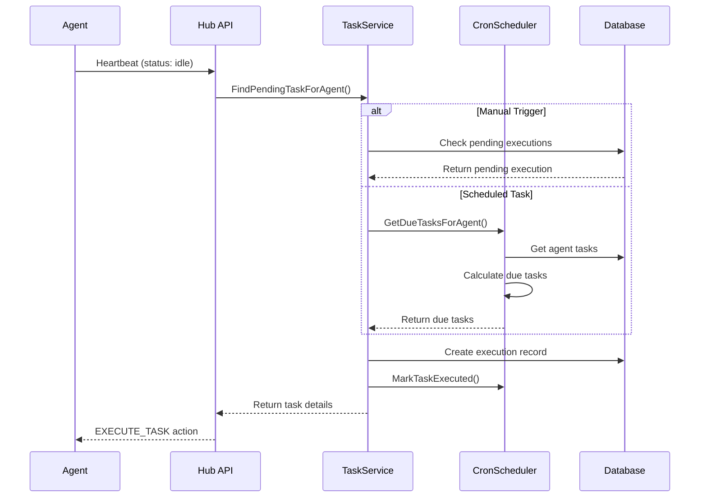
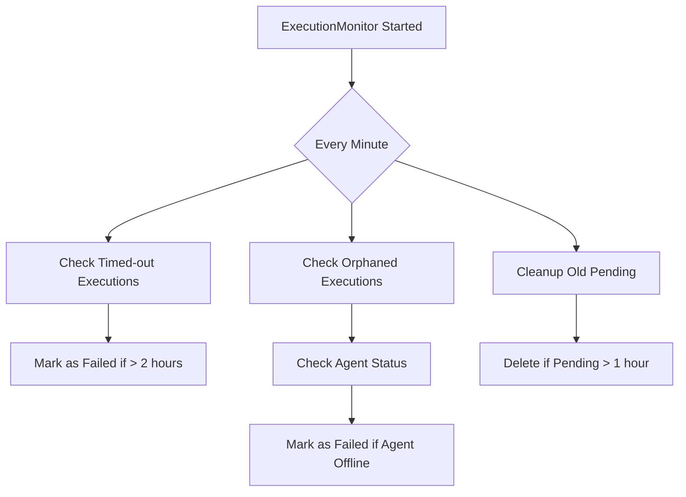

# 基于Cron的智能调度系统实现

## 实现概览

根据您的反馈，我已经完成了分布式备份系统中最关键的升级：**基于Cron的智能调度逻辑**和**执行监控系统**。这使得系统从"能工作"进化到了"好用且可靠"。

## 核心组件

### 1. CronScheduler服务 (`v2/hub/services/cron_scheduler.go`)

这是调度系统的核心大脑，负责：

- **智能的时间计算**：使用 `robfig/cron` 库解析Cron表达式，精确计算每个任务的下次执行时间
- **防止重复执行**：通过内存缓存记录每个任务的最后执行时间，确保不会在短时间内重复执行同一任务
- **灵活的调度窗口**：支持"错过窗口"检测，如果系统长时间离线后恢复，不会执行过期的任务

#### 关键特性：

```go
// 核心调度逻辑
func (s *CronScheduler) isTaskDue(ctx context.Context, task *BackupTask, now time.Time) (bool, string) {
    // 1. 解析Cron表达式
    // 2. 获取上次成功执行时间
    // 3. 计算下次应该执行的时间
    // 4. 判断是否已到执行时间
    // 5. 防止快速重复执行（最小间隔1分钟）
}
```

### 2. ExecutionMonitor服务 (`v2/hub/services/execution_monitor.go`)

这是系统的"守护者"，负责：

- **超时检测**：自动将运行超过2小时的任务标记为失败
- **孤儿任务处理**：当Agent离线时，自动将其正在运行的任务标记为失败
- **清理机制**：定期清理超过1小时未执行的pending任务

#### 监控策略：

- 每分钟检查一次所有执行中的任务
- Agent离线超过5分钟即视为掉线
- 任务执行超过2小时视为超时

### 3. 增强的TaskService (`v2/hub/services/task_service.go`)

集成了CronScheduler，提供统一的任务调度接口：

```go
// 查找需要执行的任务
func (s *TaskService) FindPendingTaskForAgent(ctx context.Context, agentID uuid.UUID) (*BackupTask, error) {
    // 1. 优先处理手动触发的任务
    // 2. 检查定时任务是否到期
    // 3. 标记已派发的任务，防止重复
}
```

## 工作流程

### 任务派发流程



### 执行监控流程



## 测试验证

创建了完整的测试脚本 `v2/test/test_scheduling.sh`，可以：

1. 创建一个每分钟执行的测试任务
2. 注册测试Agent
3. 模拟心跳并验证任务派发
4. 检查执行历史
5. 自动清理测试数据

### 运行测试：

```bash
cd v2/test
./test_scheduling.sh
```

## 关键改进点

### 1. 防止任务风暴

- **最小间隔控制**：同一任务两次执行之间至少间隔1分钟
- **状态检查**：Agent报告busy时不派发新任务
- **窗口检测**：错过执行窗口的任务会被跳过

### 2. 容错机制

- **Agent离线检测**：自动处理Agent突然离线的情况
- **执行超时**：防止任务永远卡在running状态
- **自动清理**：定期清理异常状态的记录

### 3. 实时反馈

- **SSE事件**：任务派发时立即通知前端
- **详细日志**：记录每个调度决策的原因
- **状态追踪**：完整记录任务生命周期

## 性能优化

### 内存缓存

使用内存缓存记录最近的执行时间，减少数据库查询：

```go
type CronScheduler struct {
    executionCache map[uuid.UUID]time.Time // taskID -> last execution time
    cacheMux       sync.RWMutex
}
```

### 批量处理

在心跳响应中可以同时处理多个操作：

- 任务执行
- 配置同步
- 状态更新

## 下一步工作

根据您的建议，系统核心引擎已经完全就绪。接下来的重点是：

### 1. 实现日志流 (最高优先级)

需要实现Agent到Hub的实时日志上报：

- Agent端：在执行过程中定期获取rclone日志
- Hub端：通过SSE推送日志到前端
- 存储：将日志追加到数据库

### 2. 构建Web UI

后端API已经完备，可以开始构建前端界面：

- Rclone远程配置管理
- 备份任务管理（支持Cron表达式）
- Agent管理和状态监控
- 执行历史和日志查看

### 3. 增强功能

- 任务重试机制
- 更细粒度的并发控制
- 性能指标收集（Prometheus）
- 邮件/Webhook通知

## 总结

通过这次更新，我们成功实现了：

✅ **基于Cron的智能调度**：精确控制任务执行时间  
✅ **执行监控和超时处理**：确保系统稳定性  
✅ **防重复执行机制**：避免任务风暴  
✅ **完整的错误处理**：优雅处理各种异常情况  
✅ **测试验证脚本**：确保功能正常工作  

**系统现在已经具备了生产环境所需的核心调度能力！** 🎉

接下来，让我们继续完成日志流和Web UI，让这个强大的分布式备份系统变得更加完善和易用。